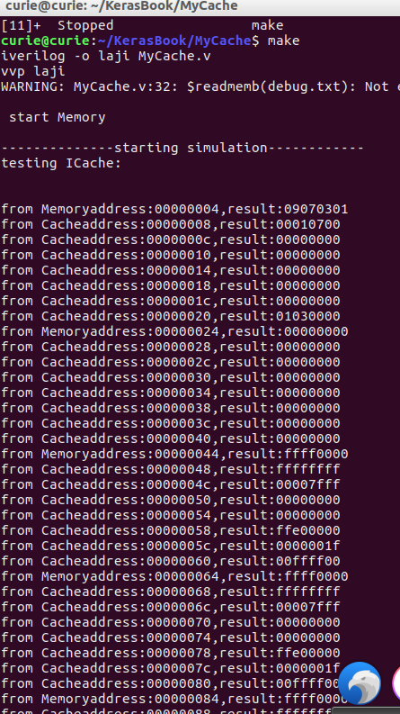

# MyCache

----------------------------------------
环境：Ubuntu16.10  
工具：

- iverilog (Verilog编译器)
- gtkwave (波形查看器)
- Atom (编辑器)  
---------------------------------------
Cache 参数：容量8KB   
Memory参数：容量128MB  
块大小：8个字  
字长：32bit  
映射方法 ：直接映射  
分析：  
- 按字节编址，每块8个字，每个字4个字节，也就是32个字节,块内偏移 w = 5.
主存容量128MB(2^27B)  
`主存地址` （s+w=`27`位）： (s-r) + r + w = 27 bit

标志Tag    | 行地址Line  | 字地址Word
------    |------------|----------
（s-r)=14 | r=8        | w=5
- `Cache` 地址  （8+5=`13`位） r=8 w=5

行地址Line  | 字地址Word
------------|----------
r=8        | w=5
- PC：30位,对应32位地址线的高32位:A31~A2.
- 因为每次访问的必须是32bit,即4个字节，（也决定了只能访问偶地址，且要是4的整数倍）故地址线的低两位A1=0,A0=0.

---------------------------------------

为方便观察Memory中的内容，不妨生成一幅由01组成的hello,world字符画。

terminal:
``` sh
python getASCIIpic.py helloworld.png
```
运行后得到Memory*32*8*256.txt,这里为了方便观察前几行内容，不妨把
前面的01串稍稍修改，另存为debug.txt,如图示


---------------------------------------

makefile内容：
```makefile
# encoding:utf-8
################################
ok:
	iverilog -o laji MyCache.v
	vvp laji
```
打开终端，cd到当前文件夹，敲make，仿真结果如图


-------------------------------------

结果分析： Cache与主存以块为单位交换，每块8个字，
这里地址按顺序增长，先从主存读数据，并调一块到Cache,
这样下面剩下的7个字，可以每次从Cache读一个字（32bit），
然后又调入新的一块，由此类推。故：一次读主存，隔7次从
Cache读的，然后又从主存读，如此循环往复。
开始我始终仿真不对，根源在CPU的clk等待时间太短了，改成
clk =#20 !clk;才通过了，CPU周期一定要>>脉冲周期。

---------------------------------------
iverilog和gtkwave安装（Linux终端命令）：
```sh
sudo apt-get install iverilog
sudo apt-get install gtkwave
```
本程序运行命令：
```
git clone git://github.com/Twopothead/MyCache.git
ls
cd MyCache
make
```
